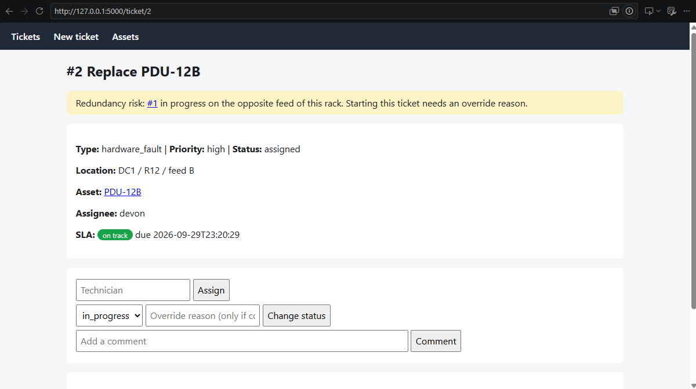

# Datacenter Ticketing

[](https://github.com/Polarwanda/dc-ticketing/actions/workflows/tests.yml)

A lightweight ticket system for datacenter operations, with a command-line tool and a Flask web UI. Its headline feature is **redundancy conflict detection**: it stops two separate tickets from taking down both power feeds of the same rack.

<!-- Add screenshots after running seed_demo.py, then uncomment:


-->

## The problem it solves

Racks are usually powered by two independent feeds (A and B) so one can fail without an outage. The classic mistake: one technician works on the A-side PDU, another (on a different shift) works on the B-side PDU, and each ticket looks harmless on its own. Together they cut power to the rack. Generic ticket tools don't model the physical power path, so they can't warn about it.

## Features

- **Redundancy conflict detection**: starting work is blocked if a ticket on the *opposite* feed of the same rack is already in progress. Overriding requires a written reason, which is recorded in the audit trail.
- **SLA timers**: each priority has a resolution target (critical 4h, high 8h, medium 24h, low 72h). Tickets show as on track, at risk (last 25% of the window), breached, or met.
- **Asset linking**: register assets (servers, PDUs, switches) and link tickets to them. A linked ticket inherits the asset's site, rack and feed.
- **Enforced workflow**: statuses can only move along allowed paths (e.g. you can't close a ticket that's still in progress).
- **Audit trail**: every change is written to a history log.
- **Two interfaces, one core**: the CLI and web app share the same logic in `core.py`.

## Quick start

Requires Python 3.10+.

```bash
git clone https://github.com/Polarwanda/dc-ticketing.git
cd dc-ticketing
python -m venv .venv && source .venv/bin/activate   # Windows: .venv\Scripts\activate
pip install -r requirements.txt

python seed_demo.py              # optional demo data
flask --app app run --debug      # open http://127.0.0.1:5000
```

## Command-line usage

```bash
python cli.py asset-add PDU-12B "Rack 12 PDU B" --site DC1 --rack R12 --feed B
python cli.py create "Replace PDU-12B" --type hardware_fault --priority high --asset PDU-12B
python cli.py assign 1 devon
python cli.py status 1 in_progress
python cli.py status 1 in_progress --override "Feed A isolated, approved by shift lead"
python cli.py list --status in_progress
python cli.py show 1
```

## How the redundancy check works

When a ticket moves to `in_progress`, `core.find_conflicts()` looks for other in-progress tickets with the same site and rack but the opposite feed. If any exist, `RedundancyConflict` is raised and the status doesn't change. Passing an `override_reason` allows it and logs the override with the IDs it conflicted with. Tickets without a full site/rack/feed are never flagged, since there's nothing reliable to compare.

## Tests

```bash
python -m unittest discover -s tests -v
```

The suite covers ticket validation, the workflow rules, asset linking, redundancy conflicts (blocked, overridden, same feed, different rack, no location), SLA states, and the web routes through Flask's test client. CI runs it on every push (see `.github/workflows/tests.yml`).

## Project structure

```
core.py          business logic and SQLite access (no printing, no web)
cli.py           command-line interface
app.py           Flask web app (create_app factory)
templates/       Jinja HTML templates
seed_demo.py     demo data loader
tests/           unittest suite
```

## Design decisions

- **SQLite** keeps setup to zero. It's ideal for a single-site tool; a multi-user deployment would move to PostgreSQL.
- **Shared core**: business rules live in one module, so the CLI and web UI can't drift apart.
- **Parameterised SQL** everywhere, so user input can't inject SQL.
- **Transactions**: each action and its history entry save together or not at all.

## Known limitations and roadmap

- No login or user roles (anyone with access can act as any technician).
- SLA clock doesn't pause while a ticket is `on_hold`.
- Conflict detection covers power feeds only. Network pairs and cooling redundancy are natural extensions.
- Feed data is entered manually. Syncing from a DCIM tool such as NetBox would remove that step.
- Ideas: email/Slack alerts on SLA breach, scan-to-close with asset barcodes, ticket-to-ticket links.
